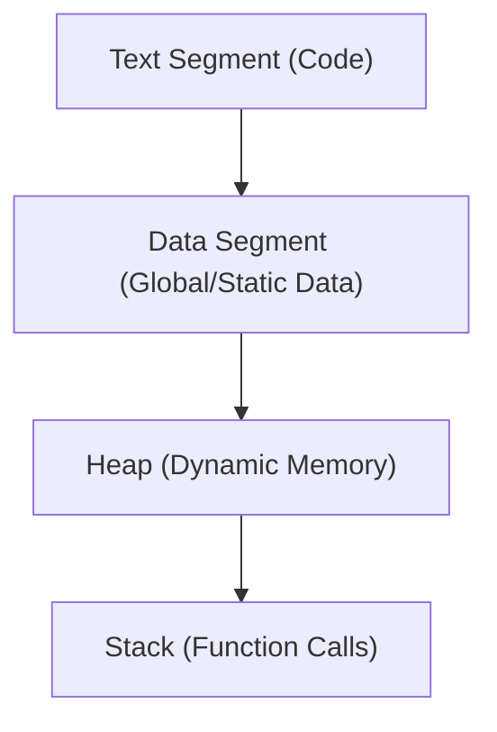

---
<!-- slide template="[[Base Slide]]" -->
::: title

#### What Is an Operating System?

:::

- A fancy resource manager.
- Abstracts away device management (CPU, memory, I/O devices, etc.).
- Exports logical interface for user applications (system calls, libraries) to interact with hardware indirectly.
-  Why? **makes it easier to write programs that run on a variety of hardware without knowing all low level details **
	- we will focus on its ability to make running programs simple-- i.e. without having to care about the gory details of the underlying hardware 

---
<!-- slide template="[[Base Slide]]" -->

::: title

#### Operating System Kernel

:::

- The component of the OS responsible for  _virtualization_ of resources.
	- The kernel is a dirty dirty liar
- Coordinates CPU, memory, and I/O device interactions.
- Implements isolation and protection so userland processes don’t directly manipulate hardware.
- Comes in many flavors such as monolithic vs micro vs hybrid
---
<!-- slide template="[[Base Slide]]" -->

::: title

#### The Linux Operating System

:::

- Open-source, community-developed.
- Multi-architecture: supports 32-bit, 64-bit x86, ARM (including AArch64), RISC-V, and more.
- Broad usage in servers, desktops, embedded systems, IoT devices, HPC, mobile (Android), and beyond.
- We’ll focus on a 64-bit ARM (ARMv8-A / AArch64)  Ubuntu distribution of Linux.
	- Blah blah "GNU+Linux" Blah Blah

---
<!-- slide template="[[Base Slide]]" -->

::: title

#### Devices That Run Linux

:::

- Desktop computers and laptops
- Cloud servers (e.g., AWS Graviton)
- Mobile devices and tablets (Android)
- Embedded and IoT platforms (Raspberry Pi, various ARM boards, embeded linux)
- Supercomputers (HPC clusters)
- Each environment has different constraints (power, screen size, memory, etc.).


---
<!-- slide template="[[Base Slide]]" -->
::: title

#### The Linux Kernel

:::

- Monolithic design (optionally) with dynamically loadable modules.
- Userland vs Kernel
- Most low level objects and their lifetimes are managed by the *kernel* 
- These objects are represented as a  *file descriptor* (including devices) in userland.
- Resource objects exist in-kernel (task_struct, inodes, etc.) but are not directly accessible to userland.
- The kernel brokers access to these objects and exports an interface for userland in the form of System calls (syscalls)
	- These require hardware support to implement 


---
<!-- slide template="[[Base Slide]]" -->


::: title

#### Kernel Objects

:::

- The kernel organizes resources into structures, like `task_struct` (for processes), `file` and `inode` (for open files).
- These are not typically called “objects” in Linux, but are 
- Access from userland is via file descriptors or handles returned by syscalls (e.g., `open()`).
- the kernel manages lifetimes of file descriptors 

---
<!-- slide template="[[Split Vertical]]" -->

::: title

#### Objects and File Descriptors

:::
::: left
- A file descriptor (FD) is an integer index into a per-process table referencing kernel structures.
- This allows the kernel to abstract away direct memory management of resources.
- Processes can share FDs or pass them around, enabling resource sharing with controlled security.
:::
::: right

![[fd-syscall-meme.png]]
:::


---
<!-- slide template="[[Split Vertical]]" -->

::: title

#### Interacting With the Linux OS

:::
::: left
- "Everything is a file"
- sh/bash/zsh...etc
- System calls: The core API to talk to the kernel (e.g. `open`, `read`, `write`, `fork`, `execve`).
- Several libraries that ultimately make syscalls 
- C library: Offers convenient wrappers around syscalls.
- POSIX / Extended Linux APIs.
- Direct Syscalls: Rarely done manually in C
		- usually you call glibc or another library.
		- Can be useful if for whatever reason you don't know where Libc is in memory or if it isn't loaded at all!
:::
::: right

![[open_syscall_check.excalidraw.dark.png|600]]

:::


---
<!-- slide template="[[Base Slide]]" -->

::: title

#### Example Files 

:::

  - `/dev/null` – a virtual device that discards all data.  
  - `/dev/tty` – represents the current terminal.  
  - `/proc/cpuinfo` – provides CPU information.  
  - `/proc/self` – provides information about the current running process.
- `stdout`, `stdin`, and `stderr` are three standard streams that are pre-connected to a program when it starts. 
- They are used for input, output, and error messages, respectively and are assigned file descriptors 0,1,2 


---
<!-- slide template="[[Base Slide]]" -->

::: title

#### `procfs` 

:::
-  `/proc` is a pseudo-filesystem that contains runtime system information about processes and the kernel.  
- i.e. a virtual file system that presents information or functionality not stored on a physical disk 
- **Examples**:  
  - `/proc/<PID>/maps` – memory mappings of a process.  
  - `/proc/<PID>/fd/` – symbolic links to file descriptors of a process.
  - `/proc/<PID>/cmdline`: commandline (argv) of the process 
  - `/proc/<PID>/status` information about the process (name, pid, ppid ..etc)
  - can reference current process via `/proc/self/`
---
<!-- slide template="[[Split Vertical]]" -->

::: title

#### Process Resources

:::

::: left

- PID (unique to each process).
- Security context (UID, GID, supplementary groups).
- Table of open file descriptors.
- A private (or shared) virtual address space.
- One or more threads.

:::

::: right
<code>
<pre>
 $ sudo ls /proc
1      16     216    309    372    42730  470	 481	50418  54663  6      64     65591  74	895	     driver	  kpagecgroup	 partitions	uptime
11     16982  22     31     373    430	  471	 483	50448  54673  60     64177  65592  75	9	     execdomains  kpagecount	 schedstat	version
117    17     232    31239  39	   431	  472	 484	50449  547    60375  64373  66	   76	asound	     fb		  kpageflags	 self		vmallocinfo
11959  179    233    31298  4	   43519  473	 485	51     54830  60440  64374  67	   77	buddyinfo    filesystems  latency_stats  slabinfo	vmstat
11960  18     24     31299  40	   44	  474	 486	52139  549    60655  64674  68	   79	bus	     fs		  loadavg	 softirqs	zoneinfo
12     18404  25     32     40683  444	  47687  49	53     55     61     65     7	   86	cgroups      interrupts   locks		 stat
120    19     26     32647  40689  45	  477	 49316	53086  56     611    65308  70	   869	cmdline      iomem	  mdstat	 swaps
12485  19054  27     32784  40737  46	  47769  49328	532    56282  61352  65490  71	   87	consoles     ioports	  meminfo	 sys
12880  19055  278    32795  40768  462	  47770  49685	538    56286  61392  65493  72	   873	cpuinfo      irq	  misc		 sysrq-trigger
13     2      29     34     41566  463	  478	 49697	539    564    614    65497  723    874	crypto	     kallsyms	  modules	 sysvipc
14     20     3      369    41605  46482  479	 5	54     567    61793  65507  726    88	devices      keys	  mounts	 thread-self
143    21     30     370    42	   46728  47983  50	540    580    61822  65543  73	   89	device-tree  key-users	  net		 timer_list
15     215    30388  371    42724  47	  480	 50389	541    59     620    65590  733    894	diskstats    kmsg	  pagetypeinfo	 tty
$ ps aux | head
USER         PID %CPU %MEM    VSZ   RSS TTY      STAT START   TIME COMMAND
root           1  0.0  0.1 170592 11680 ?        Ss   Jan08   0:18 /sbin/init
root           2  0.0  0.0      0     0 ?        S    Jan08   0:00 [kthreadd]
root           3  0.0  0.0      0     0 ?        S    Jan08   0:00 [pool_workqueue_release]
root           4  0.0  0.0      0     0 ?        I<   Jan08   0:00 [kworker/R-rcu_g]
root           5  0.0  0.0      0     0 ?        I<   Jan08   0:00 [kworker/R-rcu_p]
root           6  0.0  0.0      0     0 ?        I<   Jan08   0:00 [kworker/R-slub_]
root           7  0.0  0.0      0     0 ?        I<   Jan08   0:00 [kworker/R-netns]
root           9  0.0  0.0      0     0 ?        I<   Jan08   0:00 [kworker/0:0H-events_highpri]
root          11  0.0  0.0      0     0 ?        I    Jan08   0:00 [kworker/u8:0-netns]
</pre>
</code>
:::


---
<!-- slide template="[[Base Slide]]" -->

::: title

#### `/proc/%d/fd/` 

:::
- entries in the file descriptor table can be found  in `/proc/<pid>/fd/<fd_num>`
- echo "hi there" >/proc/`echo $$`/fd/0

---
<!-- slide template="[[Base Slide]]" -->

::: title

#### Processes

:::

- A process is essentially a container for resources required to run a program: memory, file descriptors, scheduling parameters, etc.
- All userland code runs inside _some_ process context.
- A process is identified by a PID (process ID).
- PIDs are globally unique
- PPID = parent PID 
- Code actually runs via one or more threads within the process.

---
<!-- slide template="[[Base Slide]]" -->

::: title

#### Threads

:::

- The actual _unit of execution_.
- Each thread has its own CPU state (registers, stack pointer).
- Linux implements threads as processes that share many resources (e.g., memory, FD table).
- On ARM64, each thread can independently run on any available CPU core.


---
<!-- slide template="[[Split Vertical]]" -->

::: title

#### Virtual Memory

:::
::: left 
- User land perspective: memory is a linear block of byte-addressable memory 
- Physical memory: a linear array of bytes.
- Logically organized into Physical Pages 
- Usually Address is Physical Page Number (PPN) + offset
- On ARM64, addresses are 64-bit but typically not all 64 bits are used (e.g., 48-bit or 52-bit virtual addressing depending on kernel config).
- Byte-addressable means each address points to an 8-bit chunk.
- Memory is organized into segments. 
	- `/proc/self/maps`
	- `/proc/self/mem`
:::
::: right

![[os-mem-lie.png]]
:::
---
<!-- slide template="[[Base Slide]]" -->

::: title

#### Virtual Memory

:::

- Each process sees its own _private virtual address space_.
- For 64-bit ARM, theoretically up to $2^{52}$ , though practically less.
- The kernel’s memory manager maps virtual pages to physical pages.
- The process has the illusion of a large contiguous memory region.
- Memory can be shared by mapping it as shared

---
<!-- slide template="[[Split Vertical]]" -->

::: title

#### Process Virtual Memory

:::

::: left

- Linux uses page tables to map virtual to physical memory.
- Kernel and user share the same address space mapping but in separate regions (on typical 64-bit distros, top addresses for kernel, lower for user).

:::

::: right
<code>
<pre>
$ cat /proc/self/maps
5555f9310000-5555f931c000 r-xp 00000000 103:02 1777                      /usr/bin/cat
5555f932c000-5555f9330000 r--p 0000c000 103:02 1777                      /usr/bin/cat
5555f9330000-5555f9334000 rw-p 00010000 103:02 1777                      /usr/bin/cat
5555fcab8000-5555fcadc000 rw-p 00000000 00:00 0                          [heap]
7fff13b5c000-7fff13b84000 rw-p 00000000 00:00 0 
7fff13b84000-7fff13e70000 r--p 00000000 103:02 10954                     /usr/lib/locale/locale-archive
7fff13e70000-7fff13ff8000 r-xp 00000000 103:02 5543                      /usr/lib/aarch64-linux-gnu/libc.so.6
7fff13ff8000-7fff1400c000 ---p 00188000 103:02 5543                      /usr/lib/aarch64-linux-gnu/libc.so.6
7fff1400c000-7fff14010000 r--p 0018c000 103:02 5543                      /usr/lib/aarch64-linux-gnu/libc.so.6
7fff14010000-7fff14014000 rw-p 00190000 103:02 5543                      /usr/lib/aarch64-linux-gnu/libc.so.6
7fff14014000-7fff14020000 rw-p 00000000 00:00 0 
7fff1403c000-7fff14064000 r-xp 00000000 103:02 5306                      /usr/lib/aarch64-linux-gnu/ld-linux-aarch64.so.1
7fff1406c000-7fff14074000 r--p 00000000 00:00 0                          [vvar]
7fff14074000-7fff14078000 r-xp 00000000 00:00 0                          [vdso]
7fff14078000-7fff1407c000 r--p 0002c000 103:02 5306                      /usr/lib/aarch64-linux-gnu/ld-linux-aarch64.so.1
7fff1407c000-7fff14080000 rw-p 00030000 103:02 5306                      /usr/lib/aarch64-linux-gnu/ld-linux-aarch64.so.1
7fffe7464000-7fffe7488000 rw-p 00000000 00:00 0                          [stack]
</pre>
</code>

:::

---
<!-- slide template="[[Base Slide]]" -->

::: title

#### Virtual Memory Concepts

:::

- Page tables & translation walks (done by hardware MMU).
-  Usually 4 KB pages by default on many ARM64 configs, sometimes 64 KB.
- Memory protections (read, write, execute bits).
- Kernel address space vs. user address space.
	- PPN/VPN

---
<!-- slide template="[[Base Slide]]" -->

::: title

#### Memory Layout

:::


- User space typically in lower half of the virtual address space, kernel in upper half.
- The stack grows downward, the heap grows upward.
- The binary’s code (.text), data (.data, .bss), and other segments are mapped into memory at runtime.


---
<!-- slide template="[[Base Slide]]" -->

::: title

#### Memory

:::

- **Virtual**: The illusion of contiguous memory for each process.
	- **Stack**: Manages local variables and function calls (grows downward).
		- generally used when the size of something is known at compile time
	- **Heap**: Dynamically allocated space (via `malloc()` / `free()` in C).
		- generally used when a size is only known at runtime


---
<!-- slide template="[[Base Slide]]" -->

::: title

#### Interacting with memory 

:::
- ...  Managng the heap memory of a process. 
- `brk`: Sets the end of the process's data segment.
- sbkr`: change the data segment size
	- positive: increment heap
	- negatie: shrink heap
	- 




---
<!-- slide template="[[Base Slide]]" -->

::: title

#### `sbrk` example

:::

```c
#include <unistd.h>
#include <stdio.h>

int main() {
    void *initial = sbrk(0); // Get current break point
    printf("Initial break: %p\n", initial);

    sbrk(4096); // Grow heap by 4 KB
    void *new_break = sbrk(0);
    printf("New break: %p\n", new_break);

    return 0;
}
```

---
<!-- slide template="[[Base Slide]]" -->

::: title

#### `mmap/munmap`

:::
- Maps a device or file into memory 
	- File-backed memory for efficient I/O.
	- Memory sharing between processes.
	- Large, contiguous memory allocation with demand-paged access.

---
<!-- slide template="[[Base Slide]]" -->

::: title

#### Memory Protections

:::
- PROT_EXEC  Pages may be executed.
- PROT_READ  Pages may be read.
- PROT_WRITE Pages may be written.
- PROT_NONE  Pages may not be accessed
- shellcode example: `mmap` with `PROT_EXEC | PROT_READ | PROT_WRITE`
```
void *exec_mem = mmap(
	NULL, 
	sizeof(shellcode), 
	PROT_READ | PROT_WRITE | PROT_EXEC, 
	MAP_ANONYMOUS | MAP_PRIVATE, -1, 0
	);
```


---
<!-- slide template="[[Base Slide]]" -->

::: title

#### Disk

:::

- Much slower persistent storage (eMMC, SSD, HDD).
- Cheap, large, but with high latency.
- Access typically goes through the VFS (Virtual File System).
- userland accesses disk through file system
- `/`, `/tmp`, `/etc`, `/root`, `/var`, `/bin`, `/home`
- tree structure
- Common Linux filesystems: `ext4`, `xfs`, `btrfs`.
```bash
 df -h
Filesystem      Size  Used Avail Use% Mounted on
udev            3.8G     0  3.8G   0% /dev
tmpfs           806M  6.6M  799M   1% /run
/dev/nvme0n1p2  470G   22G  424G   5% /
tmpfs           4.0G     0  4.0G   0% /dev/shm
tmpfs           5.0M   48K  5.0M   1% /run/lock
/dev/nvme0n1p1  510M   64M  447M  13% /boot/firmware
tmpfs           806M   16K  806M   1% /run/user/1000
```


---
<!-- slide template="[[Base Slide]]" -->

::: title

#### C Overview

:::

- Standard way to interact with OS is to call APIs using an agreed upon ABI
	- in theory any programming language can interact with this interface 
- C/C++ is statically typed, compiled, widely used for systems programming.
- Many Linux-based malware or system tools are in C/C++.
- No garbage collector—developers manually manage memory (`malloc`, `free`).
- We’ll use it for low-level systems programming on ARM64 Linux.

---
<!-- slide template="[[Base Slide]]" -->

::: title

#### C Concepts You Need for This Class

:::

- Basic memory management in C (heap, stack).
- Pointer arithmetic.
- Basic C data types.
- Familiarity with Compiler toolchains

---
<!-- slide template="[[Base Slide]]" -->

::: title

#### Compiler Toolchain for This Class

:::

- **gcc / g++**: The GNU compiler collection.
- **clang / clang++**: LLVM-based toolchain.
- **zig cc**: Another compiler frontend that can cross-compile out of the box.
- We can use `make` or `CMake` to simplify building.
- Cross-compilation: e.g., `aarch64-linux-gnu-gcc` if you’re on x86_64 but need ARM64 binaries.


---
<!-- slide template="[[Base Slide]]" -->
::: title
#### ELF File Format: Basic Definitions 
:::

- **ELF** (Executable and Linkable Format) is used by Linux (and many other Unix-like OSes)
- Standard executable file format. When a program is run  on a Linux system, it is often times an ELF file that is being executed. 
- It describes how code and data are laid out, plus metadata for loading
- Tools like `readelf`, `objdump`, `file` help examine ELF files

---

<!-- slide template="[[Base Slide]]" -->
::: title
#### ELF File Format on Linux/aarch64
:::

- Used for both userland and kernel modules
  - Userland: typical `.out`, `.so`, or no extension at all  
  - Kernel modules: `.ko` files  
- Architecture is specified inside the ELF headers (e.g., 0xB7 for AArch64, etc.)
- Data is grouped into segments and sections. Each section has a header with layout info

---
<!-- slide template="[[Base Slide]]" -->

::: title

#### Dynamically Linked Libraries (so)

:::


##### Refresh: What Is a Shared Object?

- A file with the “.so” extension that contains compiled code and exported functions.
- Dynamically loaded at runtime by the linker (ld-linux, ld.so).
- Reduces memory footprint and disk usage when multiple processes share the same library code.

---
<!-- slide template="[[Base Slide]]" -->

::: title

#### Shared Objects in Linux

:::

- ELF files with a “shared” type.
- Provide exported functions that your process can call at runtime.
- Examples: `libc.so`, `libm.so`, `libpthread.so`.
	- usually there: `libcrypso.so`, `libssl.so`

---
<!-- slide template="[[Base Slide]]" -->

::: title

#### The Linux C Runtime (glibc / musl)

:::

- Most common on mainstream distros is **glibc**. Some embedded systems use **musl** or **uclibc**.
- Offers standard C library functions: I/O, string manipulation, memory allocation.
- Sits on top of the Linux syscall interface.
- Maintains compatibility across kernel versions for user apps.
- Usually dynamically linked, but can be statically linked in some cases (musl)

---
<!-- slide template="[[Base Slide]]" -->

::: title

#### Example: hello world for the 10th time

:::

```c
#include <stdio.h>

int main(){
    printf("Hello world!\n");
    return 0;
}
```

- Under the hood, this calls `write()` on file descriptor 1 (stdout) via glibc’s `printf`.
- On ARM64, glibc uses the `svc #0` instruction to trigger a syscall, passing registers set up for `SYS_write`.


---
<!-- slide template="[[Base Slide]]" -->

::: title

#### Process Creation 

:::
- ultimately, the kernel is responsible for creating/destroying processes 
- Linux provides multiple ways to create new processes.
- Key system calls for process creation:
  - `fork`
  - `execve`
  - `posix_spawn()` (not covered)
  - other weird ways
- library functions 
- `system()` (calls fork)
  - `popen()` (calls fork)


---
<!-- slide template="[[Base Slide]]" -->

::: title

#### Comparison 

:::

|Method|Creates Process?|Replaces Process?|Can Capture Output?|Recommended Use|
|---|---|---|---|---|
|`fork()`|✅ Yes|❌ No|❌ No|General process creation|
|`vfork()`|✅ Yes|❌ No|❌ No|Fast process creation (risky)|
|`execve()`|❌ No|✅ Yes|❌ No|Run a new program|
|`posix_spawn()`|✅ Yes|❌ No|❌ No|Portable, optimized process creation|
|`system()`|✅ Yes|❌ No|❌ No|Simple shell command execution|
|`popen()`|✅ Yes|❌ No|✅ Yes|Capture process output|

---
<!-- slide template="[[Split Vertical]]" -->

::: title

#### `fork`
:::
::: left
Creates a duplicate of the calling process.
- **Returns:**
  - **0** for the child process.
  - **PID of the child** for the parent process.
  - **-1** if creation fails.*
  - `man fork`
::: 
::: right 
<iframe width="908" height="511" src="https://www.youtube.com/embed/jVhMt26F7gA?start=27" title="2 Chainz - Fork (Official Music Video) (Explicit)" frameborder="0" allow="accelerometer; autoplay; clipboard-write; encrypted-media; gyroscope; picture-in-picture; web-share" referrerpolicy="strict-origin-when-cross-origin" allowfullscreen></iframe>
:::


---
<!-- slide template="[[Base Slide]]" -->

::: title

#### `execve`
:::
- Replaces the current process with a new one.
- **Does NOT return** if successful.
- **Common variants:** `execl()`, `execv()`, `execle()`, `execvp()`.
- `man execve`


---
<!-- slide template="[[Base Slide]]" -->

::: title

#### Libc Process creation
:::
- `system: system("ls -l");`
- `popen: `Runs a command and **redirects its output**
 

