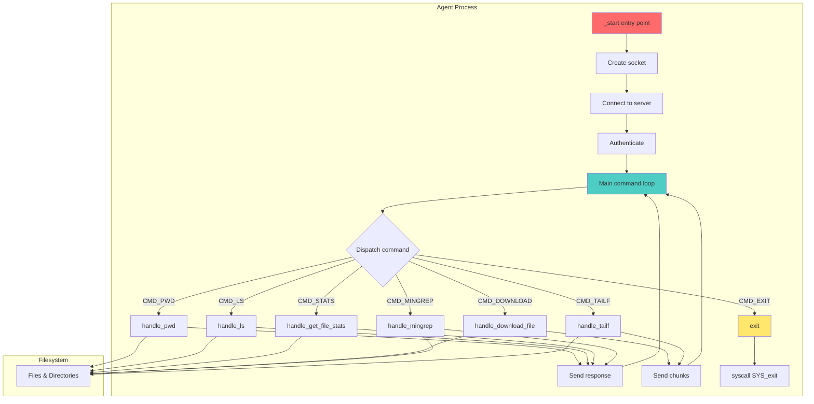

```mermaid
graph TB
    subgraph "Agent Process"
        A[_start entry point] --> B[Create socket]
        B --> C[Connect to server]
        C --> D[Authenticate]
        D --> E[Main command loop]

        E --> F{Dispatch command}

        F -->|CMD_PWD| G1[handle_pwd]
        F -->|CMD_LS| G2[handle_ls]
        F -->|CMD_STATS| G3[handle_get_file_stats]
        F -->|CMD_DOWNLOAD| G4[handle_download_file]
        F -->|CMD_MINGREP| G5[handle_mingrep]
        F -->|CMD_TAILF| G6[handle_tailf]
        F -->|CMD_EXIT| Z[exit]

        G1 --> H[Send response]
        G2 --> H
        G3 --> H
        G4 --> I[Send chunks]
        G5 --> H
        G6 --> I

        H --> E
        I --> E
        Z --> ZZ[syscall SYS_exit]
    end

    subgraph "Filesystem"
        FS[Files & Directories]
    end

    G1 --> FS
    G2 --> FS
    G3 --> FS
    G4 --> FS
    G5 --> FS
    G6 --> FS

    style A fill:#ff6b6b
    style E fill:#4ecdc4
    style Z fill:#ffe66d
```
