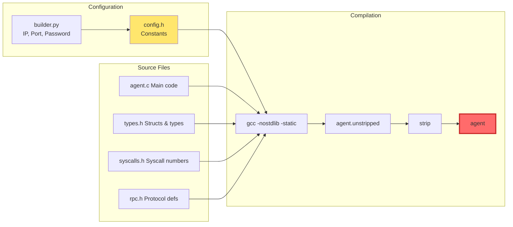

```mermaid
flowchart LR
    subgraph "Configuration"
        A[builder.py<br/>IP, Port, Password] --> B[config.h<br/>Constants]
    end

    subgraph "Source Files"
        C[agent.c Main code]
        D[types.h Structs & types]
        E[syscalls.h Syscall numbers]
        F[rpc.h Protocol defs]
    end

    subgraph "Compilation"
        B --> G[gcc -nostdlib -static]
        C --> G
        D --> G
        E --> G
        F --> G
        G --> H[agent.unstripped]
        H --> I[strip]
        I --> J[agent]
    end

    style J fill:#ff6b6b,stroke:#c92a2a,stroke-width:3px
    style B fill:#ffe66d
```
