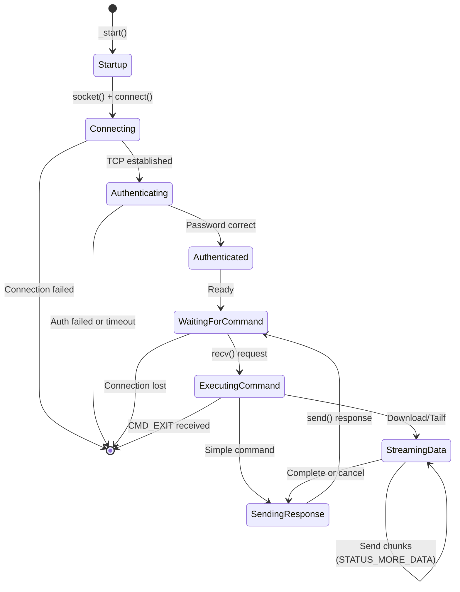

```mermaid
stateDiagram-v2
    [*] --> Startup: _start()

    Startup --> Connecting: socket() + connect()

    Connecting --> Authenticating: TCP established
    Connecting --> [*]: Connection failed

    Authenticating --> Authenticated: Password correct
    Authenticating --> [*]: Auth failed or timeout

    Authenticated --> WaitingForCommand: Ready

    WaitingForCommand --> ExecutingCommand: recv() request
    WaitingForCommand --> [*]: Connection lost

    ExecutingCommand --> SendingResponse: Simple command
    ExecutingCommand --> StreamingData: Download/Tailf

    StreamingData --> StreamingData: Send chunks<br/>(STATUS_MORE_DATA)
    StreamingData --> SendingResponse: Complete or cancel

    SendingResponse --> WaitingForCommand: send() response

    ExecutingCommand --> [*]: CMD_EXIT received
```
