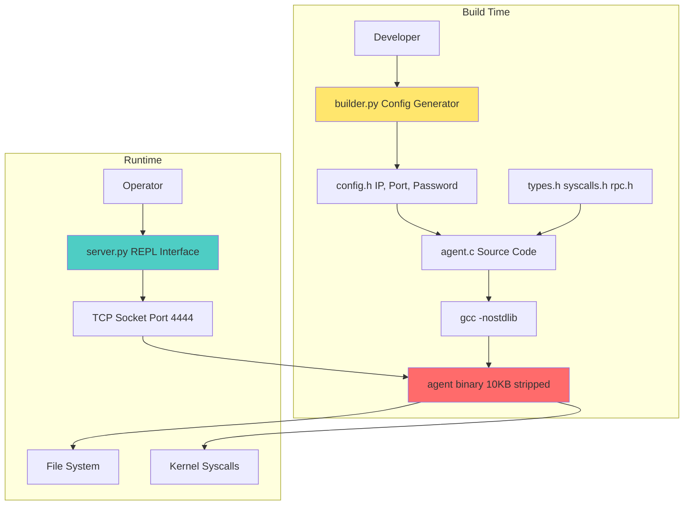

```mermaid
graph TB
    subgraph "Build Time"
        A[Developer] --> B[builder.py Config Generator]
        B --> C[config.h IP, Port, Password]
        C --> D[agent.c Source Code]
        E[types.h syscalls.h rpc.h] --> D
        D --> F[gcc -nostdlib]
        F --> G[agent binary 10KB stripped]
    end

    subgraph "Runtime"
        H[Operator] --> I[server.py REPL Interface]
        I --> J[TCP Socket Port 4444]
        J --> G
        G --> K[File System]
        G --> L[Kernel Syscalls]
    end

    style G fill:#ff6b6b
    style I fill:#4ecdc4
    style B fill:#ffe66d
```
