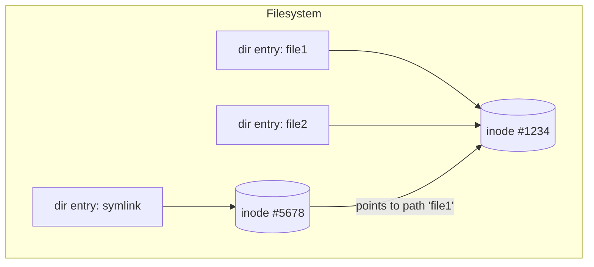

```mermaid
graph TD
    subgraph Filesystem
        A[dir entry: file1] --> I1[(inode #1234)]
        B[dir entry: file2] --> I1[(inode #1234)]
        C[dir entry: symlink] --> I2[(inode #5678)]
        I2 -->|"points to path 'file1'"| I1
    end

```
