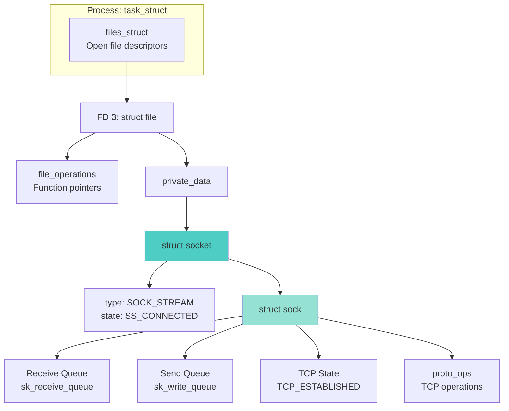

```mermaid
graph TB
    subgraph "Process: task_struct"
        A[files_struct<br/>Open file descriptors]
    end

    A --> B[FD 3: struct file]
    B --> C[file_operations<br/>Function pointers]
    B --> D[private_data]

    D --> E[struct socket]
    E --> F[type: SOCK_STREAM<br/>state: SS_CONNECTED]
    E --> G[struct sock]

    G --> H[Receive Queue<br/>sk_receive_queue]
    G --> I[Send Queue<br/>sk_write_queue]
    G --> J[TCP State<br/>TCP_ESTABLISHED]
    G --> K[proto_ops<br/>TCP operations]

    style E fill:#4ecdc4
    style G fill:#95e1d3
```
