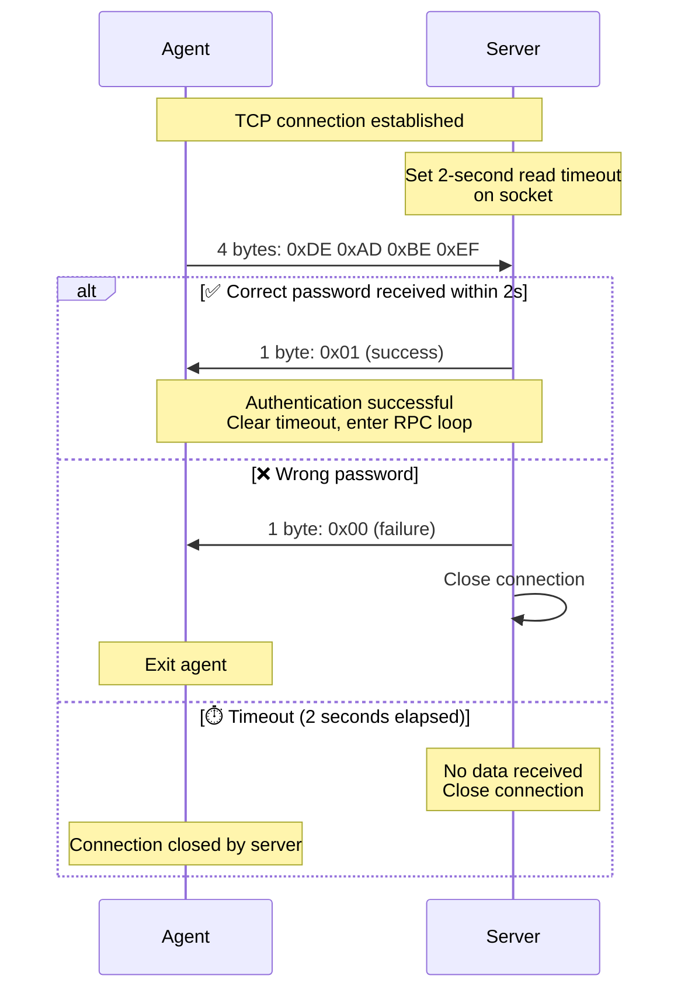

```mermaid
sequenceDiagram
    participant A as Agent
    participant S as Server

    Note over A,S: TCP connection established

    Note over S: Set 2-second read timeout<br/>on socket

    A->>S: 4 bytes: 0xDE 0xAD 0xBE 0xEF

    alt ✅ Correct password received within 2s
        S->>A: 1 byte: 0x01 (success)
        Note over A,S: Authentication successful<br/>Clear timeout, enter RPC loop
    else ❌ Wrong password
        S->>A: 1 byte: 0x00 (failure)
        S->>S: Close connection
        Note over A: Exit agent
    else ⏱️ Timeout (2 seconds elapsed)
        Note over S: No data received<br/>Close connection
        Note over A: Connection closed by server
    end
```
