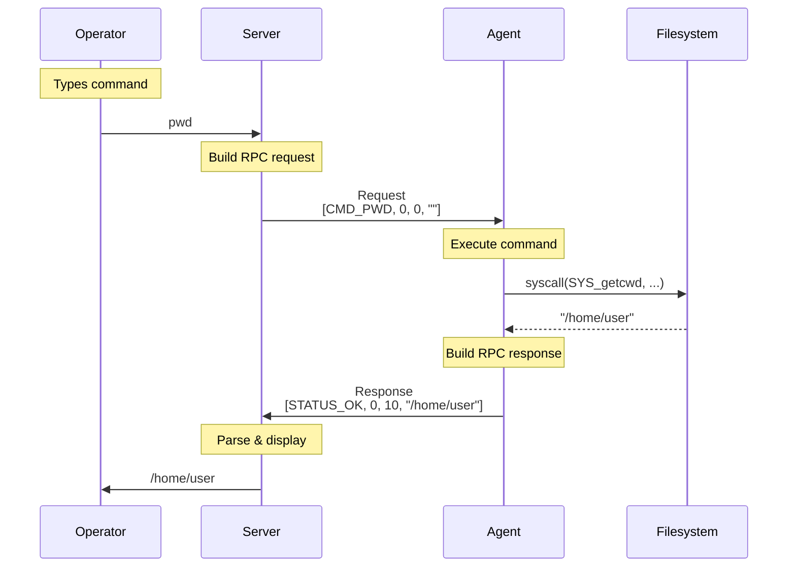

```mermaid
sequenceDiagram
    participant O as Operator
    participant S as Server
    participant A as Agent
    participant F as Filesystem

    Note over O: Types command
    O->>S: pwd

    Note over S: Build RPC request
    S->>A: Request<br/>[CMD_PWD, 0, 0, ""]

    Note over A: Execute command
    A->>F: syscall(SYS_getcwd, ...)
    F-->>A: "/home/user"

    Note over A: Build RPC response
    A->>S: Response<br/>[STATUS_OK, 0, 10, "/home/user"]

    Note over S: Parse & display
    S->>O: /home/user
```
