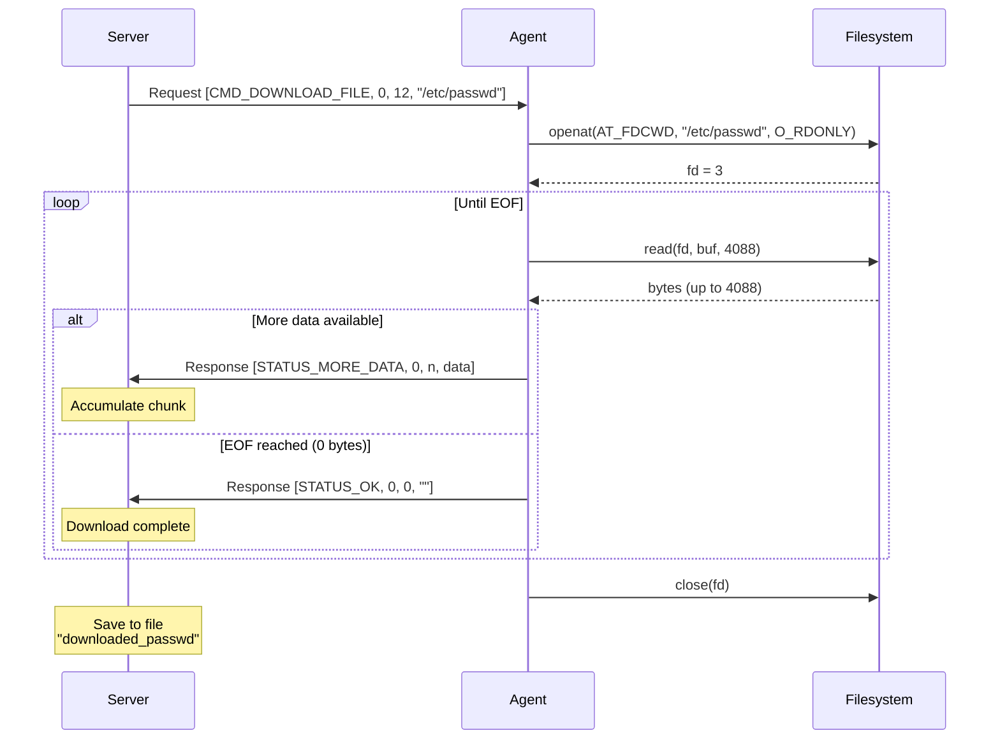

```mermaid
sequenceDiagram
    participant S as Server
    participant A as Agent
    participant F as Filesystem

    S->>A: Request [CMD_DOWNLOAD_FILE, 0, 12, "/etc/passwd"]

    A->>F: openat(AT_FDCWD, "/etc/passwd", O_RDONLY)
    F-->>A: fd = 3

    loop Until EOF
        A->>F: read(fd, buf, 4088)
        F-->>A: bytes (up to 4088)

        alt More data available
            A->>S: Response [STATUS_MORE_DATA, 0, n, data]
            Note over S: Accumulate chunk
        else EOF reached (0 bytes)
            A->>S: Response [STATUS_OK, 0, 0, ""]
            Note over S: Download complete
        end
    end

    A->>F: close(fd)

    Note over S: Save to file<br/>"downloaded_passwd"
```
