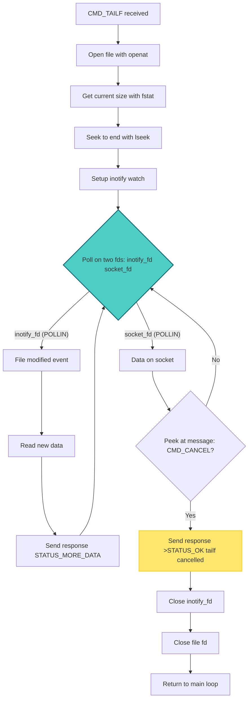

```mermaid
flowchart TB
    A[CMD_TAILF received] --> B[Open file with openat]
    B --> C[Get current size with fstat]
    C --> D[Seek to end with lseek]
    D --> E[Setup inotify watch]
    E --> F{Poll on two fds: inotify_fd socket_fd}

    F -->|"inotify_fd (POLLIN)"| G[File modified event]
    G --> H[Read new data]
    H --> I[Send response STATUS_MORE_DATA]
    I --> F

    F -->|"socket_fd (POLLIN)"| J[Data on socket]
    J --> K{Peek at message: CMD_CANCEL?}
    K -->|Yes| L[Send response >STATUS_OK tailf cancelled]
    K -->|No| F

    L --> M[Close inotify_fd]
    M --> N[Close file fd]
    N --> O[Return to main loop]

    style F fill:#4ecdc4,stroke:#0f6674,stroke-width:2px
    style L fill:#ffe66d,stroke:#ffd43b,stroke-width:2px
```
