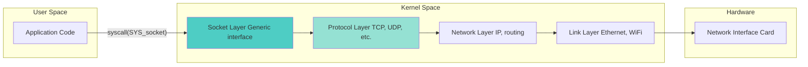

```mermaid
graph LR
    subgraph "User Space"
        A[Application Code]
    end

    subgraph "Kernel Space"
        B[Socket Layer Generic interface] --> C[Protocol Layer TCP, UDP, etc.]
        C --> D[Network Layer IP, routing]
        D --> E[Link Layer Ethernet, WiFi]
    end

    subgraph "Hardware"
        F[Network Interface Card]
    end

    A -->|"syscall(SYS_socket)"| B
    E --> F

    style B fill:#4ecdc4
    style C fill:#95e1d3
```
