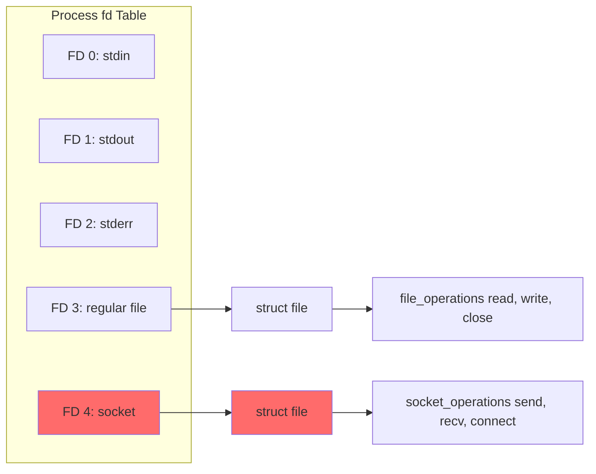

```mermaid
graph LR
    subgraph "Process fd Table"
        A[FD 0: stdin]
        B[FD 1: stdout]
        C[FD 2: stderr]
        D[FD 3: regular file]
        E[FD 4: socket]
    end

    D --> F[struct file]
    E --> G[struct file]

    F --> H[file_operations read, write, close]
    G --> I[socket_operations send, recv, connect]

    style E fill:#ff6b6b
    style G fill:#ff6b6b
```
