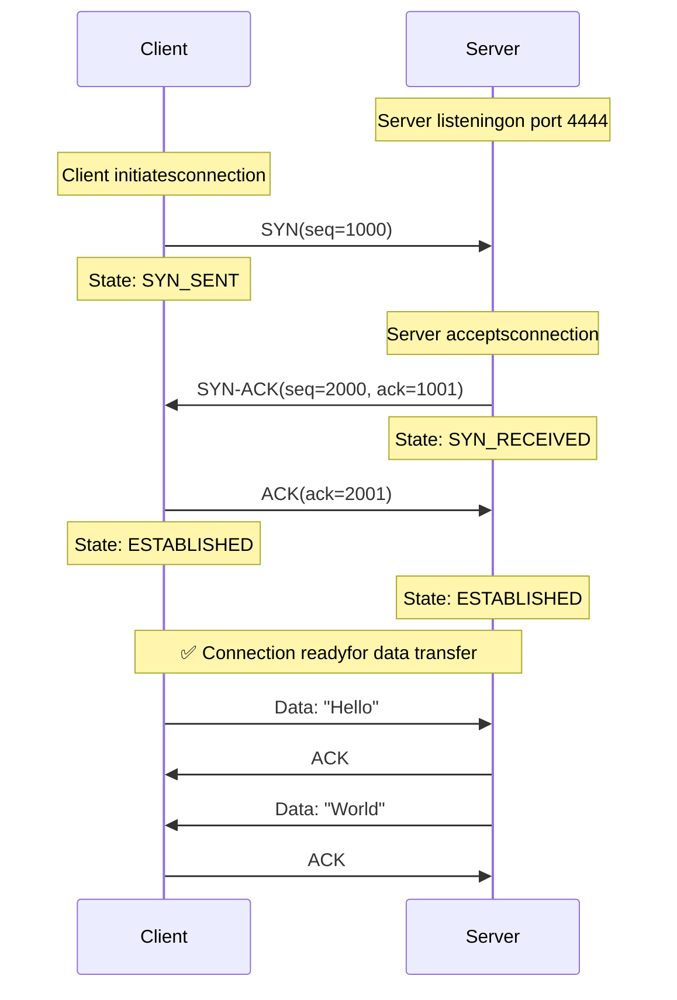

```mermaid
sequenceDiagram
    participant C as Client
    participant S as Server

    Note over S: Server listeningon port 4444

    Note over C: Client initiatesconnection

    C->>S: SYN(seq=1000)
    Note over C: State: SYN_SENT

    Note over S: Server acceptsconnection
    S->>C: SYN-ACK(seq=2000, ack=1001)
    Note over S: State: SYN_RECEIVED

    C->>S: ACK(ack=2001)
    Note over C: State: ESTABLISHED
    Note over S: State: ESTABLISHED

    Note over C,S: ✅ Connection readyfor data transfer

    C->>S: Data: "Hello"
    S->>C: ACK
    S->>C: Data: "World"
    C->>S: ACK
```
