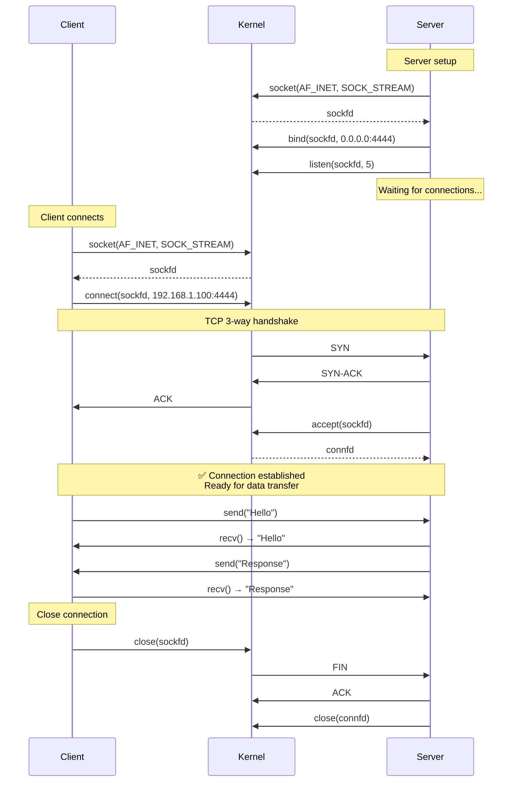

```mermaid
sequenceDiagram
    participant A as Client
    participant K as Kernel
    participant S as Server

    Note over S: Server setup
    S->>K: socket(AF_INET, SOCK_STREAM)
    K-->>S: sockfd
    S->>K: bind(sockfd, 0.0.0.0:4444)
    S->>K: listen(sockfd, 5)
    Note over S: Waiting for connections...

    Note over A: Client connects
    A->>K: socket(AF_INET, SOCK_STREAM)
    K-->>A: sockfd
    A->>K: connect(sockfd, 192.168.1.100:4444)

    Note over A,S: TCP 3-way handshake
    K->>S: SYN
    S->>K: SYN-ACK
    K->>A: ACK

    S->>K: accept(sockfd)
    K-->>S: connfd

    Note over A,S: ✅ Connection established<br/>Ready for data transfer

    A->>S: send("Hello")
    S->>A: recv() → "Hello"
    S->>A: send("Response")
    A->>S: recv() → "Response"

    Note over A: Close connection
    A->>K: close(sockfd)
    K->>S: FIN
    S->>K: ACK
    S->>K: close(connfd)
```
